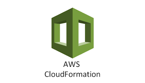

I like [CloudFormation](https://aws.amazon.com/cloudformation), I think it's a great tool. Granted, it's missing some features, and it took me a while getting used to the weird YAML files, but among the more important benefits of IaaS (Infrastructure as a Service), is the cloneability of it, which enables private isolated environments for each developer, multiple stage environments, etc, which is really mandatory if you want to have a proper CI/CD in place.

I keep to CloudFormation over Terraform and other tools, as I like to stay as close to AWS infrastructure as possible, in order to understand it in depth. Ususally this is not a problem, if you're working on AWS and do not have specific requirements to build generic/portable IaaS.

This repository contains some of the project I did with CloudFormation.

## Projects in this Repo
[CloudFormation RabbitMQ cluster](./rabbit-cluster/README.md)
A [RabbitMQ](https://www.rabbitmq.com/) cluster with scalability group, load balancer and auto-clustering

[CloudFormation Instance Scheduler](./instance-scheduler/README.md)
A simple ec2 instance start/stop using CloudWatch scheduling rules and cloudformation deployment. 

[CloudFormation Self Indexing S3 Bucket](./s3-lambda-elastic/README.md)
A S3 bucket which automatically indexes any files uploaded into elasticsearch. 
